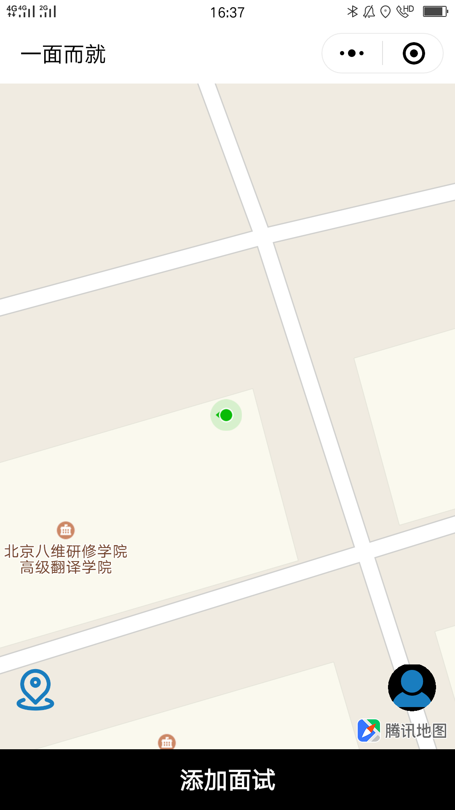
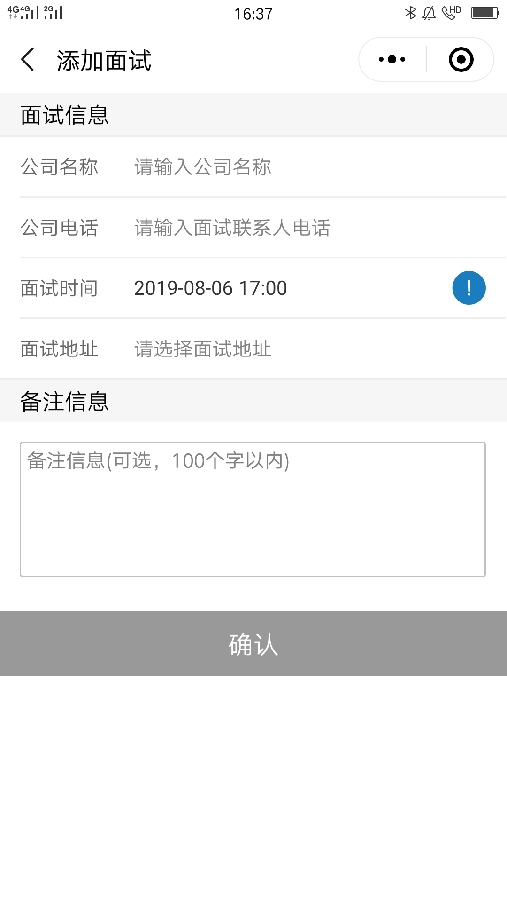
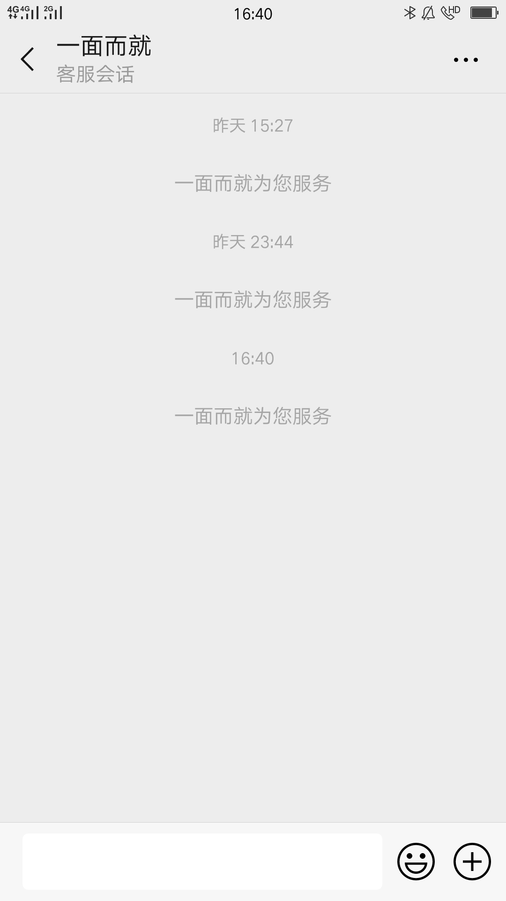
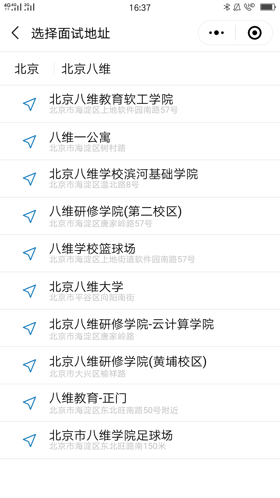
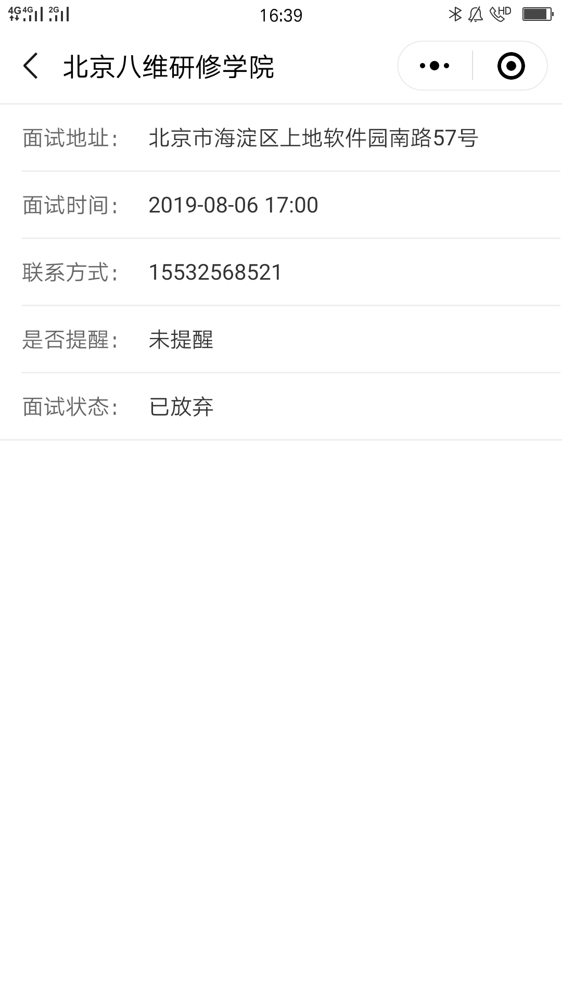
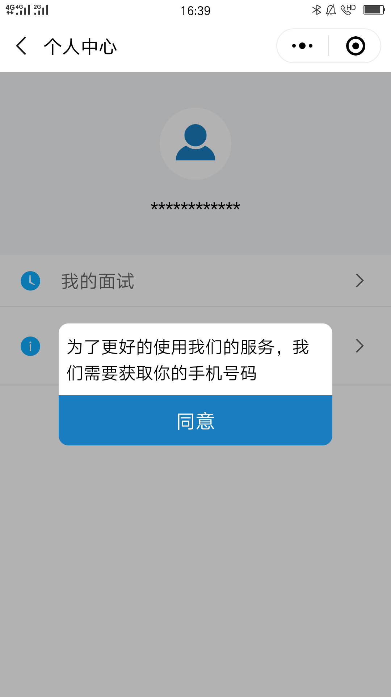

## 一面而就
#### 科学安排面试行程，提高面试效率
> 微信小程序，项目采用mpvue开发
### 功能列表
- [x] 首页
  - [x] 地图定位
  - [x] 添加面试
  - [x] 个个人心
  - [x] 试题详情
- [x] 添加面试
  - [x] 面试信息
- [x] 个人中心
  - [x] 我的面试
  - [x] 客服中心
### 截图展示

  
  
  
  
  
  
  

